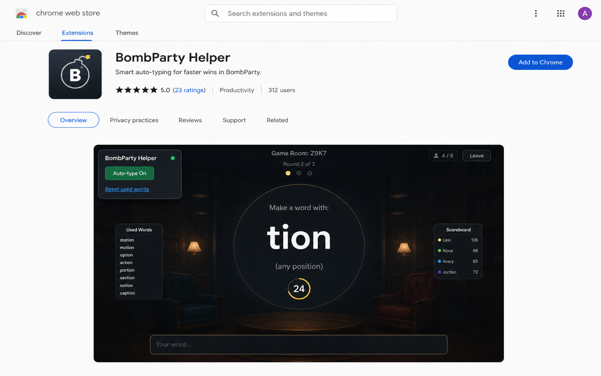

# BombParty Helper (JKLM)

Chrome extension that helps you play [BombParty](https://jklm.fun) on JKLM rooms. On your turn it picks a valid word for the syllable and submits it automatically. Toggle it off anytime from the in-page panel.

**Not affiliated with JKLM or Sparklin Labs.** Use only where assistants are allowed.



## Quick install (Chrome)

### Option A — Load unpacked (fastest, for testing)

1. Download this repo: **Code → Download ZIP**, unzip it.  
   Or clone: `git clone https://github.com/kostslava/bombparty-cheater.git`
2. Open Chrome and go to `chrome://extensions`
3. Turn on **Developer mode** (top right)
4. Click **Load unpacked**
5. Select the unzipped folder (must contain `manifest.json`)
6. Open a JKLM room, e.g. `https://jklm.fun/ABCD`, start BombParty
7. Use the **BombParty Helper** panel (top-left): **On** = auto-play, **Off** = stop

Reload the extension after updates: `chrome://extensions` → refresh icon on this extension.

### Option B — ZIP file (same as Chrome Web Store package)

```bash
cd bombparty-cheater
zip -r bombparty-helper.zip manifest.json content.js page-bridge.js words.js icons/
```

Then **Load unpacked** is not used for a zip — either unzip first and load the folder, or publish/install from the store.

### Option C — Chrome Web Store

When published, install from the store listing (one click, auto-updates).

---

## How to use

1. Join a room on `jklm.fun` and start BombParty.
2. On the room page, find **BombParty Helper** (top-left).
3. **On** — plays on your turn. **Off** — does nothing.
4. **Reset used words** — clears words remembered for this match (new game / new room).

The extension runs in the game iframe; keep it enabled on `*.jklm.fun`.

---

## Build dictionary (optional)

`words.js` is already included. To rebuild from `dict.txt`:

```bash
npm run build
```

Requires Node.js. Needs several GB RAM for the full dictionary.

---

## Project layout

| File | Purpose |
|------|---------|
| `manifest.json` | Extension config |
| `content.js` | UI, word pick, turn detection |
| `page-bridge.js` | Submits words in the game page context |
| `words.js` | Word list + indexes (generated) |
| `dict.txt` | Source dictionary |
| `tools/build-dictionary.mjs` | Builds `words.js` |

---

## Chrome Web Store

See [CHROME_WEB_STORE.md](CHROME_WEB_STORE.md) for listing text, privacy justifications, and packaging.

---

## Privacy

See [PRIVACY.md](PRIVACY.md). Data stays on your device (on/off + words used this match).

---

## License

Use at your own risk. Respect JKLM terms and other players.
